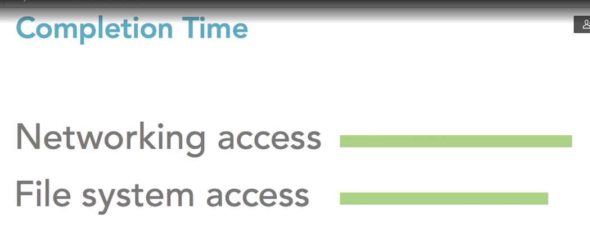

# nodejs
# jstz library
```shell
npm install jstz
node
```
```javascript
var jstz=require("jstz");
jstz.determine().name();
```

# money library
useful to transform between different currencies
```shell
npm install money 
```

```javascript
var money=require("money");
money.base="USD";
money.rates={
    "USD":1,
    "EUR":0.74,
    "CNY":6.09
};
money(100).from("USD").to("EUR");
```

# istanbul library
useful for cover
```shell
npx nyc --reporter-lcov --reporter-text-lcov npm test
npx istanbul cover node_modules/jstz/test.js         
```

# lodash library
```shell
npm install lodash
```

```javascript
var lodash=require("lodash");
var _=require("lodash");
lodash.sumBy([{value:10}, {value:20}], "value")
lodash.minBy([{value:10}, {value:20}], "value")
lodash.each([{value:10}, {value:20}], (o)=> {
    console.log(o.value);
});
lodash.eachRight([{value:10}, {value:20}], (o)=> {
    console.log(o.value);
});
lodash.countBy([{value:10}, {value:20}], "value")
lodash.maxBy([{value:10}, {value:20}], "value")
lodash.sumBy([{value:10}, {value:20}], (o) => o.value);
lodash.meanBy([{value:10}, {value:20}], (o) => o.value);
lodash.sum([1,2,3,45]);
lodash.mean([1,2,3,45]);
lodash.first([1,2,4,5]);
lodash.round(3.56);
lodash.min([-1,2,3,4]);
lodash.max([-1,2,3,4]);
lodash.every([1,21,3,4], (o) => o>0);
lodash.filter([1,21,3,4], (o) => o>0);
lodash.findLast([1,21,3,4], (o) => o>0);
lodash.flatMap([1,21,3,4], (o) => o>0);
lodash.flatMapDeep([1,21,3,[4,5,6]], (o) => o);
lodash.groupBy(["daniel", "molina", "alejo"], "length");
lodash.includes([1,2,3,4], 2);
lodash.map([1,21,3,4], (o) => o>0);
lodash.find([1,21,3,4], (o) => o>0);
lodash.chunk([1,2,3,4,5,6,7,8,9], 3);
lodash.compact([1,2,3,false, undefined, null, 0, "", 7]);
lodash.concat([1,2,37], [1,2,3]);
lodash.difference([1,2,37], [1,2,3]);
lodash.differenceBy([{value:1},{value:2},{value:37}], [{value:1}],"value");
var objects = [{ 'x': 1, 'y': 2 }, { 'x': 2, 'y': 1 }];
_.differenceWith(objects, [{ 'x': 1, 'y': 2 }], _.isEqual);

lodash.intersection([1,2,37], [1,2,3]);
lodash.intersectionBy([{value:1},{value:2},{value:37}], [{value:1}],"value");
var objects = [{ 'x': 1, 'y': 2 }, { 'x': 2, 'y': 1 }];
_.intersectionWith(objects, [{ 'x': 1, 'y': 2 }], _.isEqual);

lodash.union([1,2,37], [1,2,3]);
lodash.unionBy([{value:1},{value:2},{value:37}], [{value:1}],"value");
var objects = [{ 'x': 1, 'y': 2 }, { 'x': 2, 'y': 1 }];
_.unionWith(objects, [{ 'x': 1, 'y': 2 }], _.isEqual);

lodash.uniq([1,2,37,2,2,2]);
lodash.uniqBy([{value:1},{value:2},{value:37}], "value");


_.drop([1,2,3],100);
_.dropRight([1,2,3],1);

_.dropRightWhile([1,2,3], (o) => o>1);

_.fromPairs([["name", "daniel"], ["age",20]])

_.indexOf([1,2,3,4], 3);
_.initial([1,2,3,4]);
_.join([1,2,3,4], ",");
_.last([1,2,3,4]);
_.lastIndexOf([1,2,3,4], 2);

_.nth([1,2,3,4], -2);

var a = [1,2,3,4];
_.pullAt(a, 1);
a;

_.pull([1,2,3,4], 1, 2);
_.pullAll([1,2,3,4], [1,2]);

_.pullAllBy([{value:1},{value:2},{value:3},{value:4}], [{value:1},{value:2}], "value");

var a = [1,2,3,4,5];
_.remove(a, (o) => o < 5);
a;

_.reverse([1,2,3,5])

_.slice([1,2,3,4,6,7,8], 1, 5);

_.sortedIndex([1,2,3,4,6,7,8], 5);
_.sortedIndexBy([1,2,3,4,6,7,8], 5, (o) => o);

_.sortedUniq([1,2,3,4,4,4,4,6,7,8]);
_.take([1,2,3,4,4,4,4,6,7,8], 4);
_.takeRight([1,2,3,4,4,4,4,6,7,8], 4);
_.takeWhile([1,2,3,4,4,4,4,6,7,8], (o) => o < 5);

_.zip([10,20,30], [false, true, false]);
_.unzip([ [ 10, false ], [ 20, true ], [ 30, false ] ]);

_.without([1,2,3,41,5,641,61,32,132,132,13,21,321], 1, 2, 3);

_.xor([1,2,3,4,5,5]);
_.xorBy([1,2,3,4,5,5], (o) => o);

_.zipObject(["name", "age"], ["daniel", 20]);

_.partition([1,2,3], (o) => o%2)

_.orderBy([1,2,3,10,4,5,6], (o) => o, "desc");
_.sortBy([1,2,3,10,4,5,6], (o) => o, "desc");

_.reduce([1,2,3,10,4,5,6], (agg, n) => agg + n, 0);

_.reduceRight([1,2,3,10,4,5,6], (agg, n) => agg + n, 0);

var users = ;
 
_.reject([{ 'user': 'barney','active': false },{ 'user': 'fred','active': true }], (o)=>!o.active);
_.sample([1,2,3,415,65,5,4]);
_.sampleSize([1,2,3,415,65,5,4], 4);

_.shuffle([1,2,3,415,65,5,4]);

_.some([1,2,3,4], (o) => o > 3)

_.now()
```

# lodash library for functions
```javascript
var _=require("lodash");
var f = _.after(2, () => {
    console.log("this is the end i guest");
})
f()
f()

var f = _.ary(() => {
    console.log("this is sparta!");
}, 2);
f();
f();
f();
f(21,1);

_.map(['6', '8', '10'], _.ary(parseInt, 1));


var _=require("lodash");
var f = _.before(2, () => {
    console.log("this is the end i guest");
})
f()
f()

var object = {
  'user': 'fred',
  'greet': function(greeting, punctuation) {
    return greeting + ' ' + this.user + punctuation;
  }
};
 
var bound = _.bindKey(object, 'greet', 'hi');
bound('!');


var abc = (a, b, c) => [a, b, c];
var curried = _.curryRight(abc);
curried(1)(2)(3);

_.defer(() => {
    console.log("execute after stack is clear");
})

var f = _.debounce(() => {
    console.log("execute after stack is clear");
}, 1000)
f()

var d = {name:"damian"};
var f = _.bind(function(greeting){
    console.log(greeting + "" + this.name);
},d, ["hi"])
f();

_.delay(() => {
    console.log("daniel molina");
}, 1000);

var flipped = _.flip(function() {
  return _.toArray(arguments);
});
 
flipped('a', 'b', 'c', 'd');


var object = { 'a': 1, 'b': 2 };
var other = { 'c': 3, 'd': 4 };
var values = _.memoize(_.values);
values(object);

const isEven = (n)=>n % 2 == 0;
_.filter([1, 2, 3, 4, 5, 6], _.negate(isEven));

var f = _.once((a) => a*a);
f(10);
f(100);
f(1000);

var f = _.overArgs((a, b, c) => {
    console.log(_.join([a,b,c],":"));
}, [(n) => n*n, (n) => n*n, (n) => n*n]);
f(1,2,3);

var f = _.partial((a, b, c) => {
    console.log(_.join([a,b,c],":"));
}, 1, 2);
f(10);

var f = _.partialRight((a, b, c) => {
    console.log(_.join([a,b,c],":"));
}, 1, 2);
f(10);

var rearged = _.rearg(function(a, b, c) {
  return [a, b, c];
}, [2, 0, 1]);
 
rearged('b', 'c', 'a')

var f = _.rest((a, b, c) => {
    console.log(_.join([a, b, c], " daniel "));
}, 1);
f(1, 3, 5);

var say = _.spread(function(who, what) {
  return who + ' says ' + what;
});
 
say(['fred', 'hello']);
// => 'fred says hello'
 
var numbers = Promise.all([
  Promise.resolve(40),
  Promise.resolve(36)
]);
 
numbers.then(_.spread(function(x, y) {
  return x + y;
}));

var f = _.throttle(() => {
    console.log("this is it");
}, 1000);
f();
f();
f();
f();

var f = _.unary((a, b, c) => {
    console.log(_.join([a, b, c], " daniel "));
});
f(1, 3, 5);

_.map(['6', '8', '10'], _.unary(parseInt));

var str2 = _.escape("GFG && Geeks | <");
console.log(str2);

var p = _.wrap(_.escape, function(func, text) {
  return '<p>' + func(text) + '</p>';
});
 
p('fred, barney, & pebbles');
```

# lodash function lang
```javascript
_.castArray(1)
_.clone({name:"daniel"})
_.cloneDeep({name:"daniel"})
_.conformsTo({"name":"daniel"}, {"name":(name) => name == "daniel"})

var object = { 'a': "daniel" };
var other = { 'a': "daniel" };
_.eq(object, object);

_.isArguments(function() { return arguments; }());

_.isArray([1, 2, 3]);

_.isArrayBuffer(new ArrayBuffer(2));

_.isArrayLike([1, 2, 3]);
_.isArrayLike("daniel");
_.isArrayLikeObject([1,2,3]);
_.isBoolean(false);
_.isBuffer(new Buffer(2));

_.isDate(new Date);

_.isElement(document.body);

_.isEmpty(null);
_.isEmpty("");
_.isEmpty([]);
_.isEmpty({});

var object = { 'a': 1 };
var other = { 'a': 1 };
_.isEqual(object, other);
_.isError(new Error);

_.isFinite(3);

_.isFunction(_);
_.isInteger(3);
_.isMap(new Map);

var object = { 'a': 1, 'b': 2 };
_.isMatch(object, { 'b': 2 });

_.isNaN(NaN);

_.isNative(Array.prototype.push);

_.isNil(null);
_.isNull(null);
_.isNumber(3);
_.isObject({});
_.isObjectLike({});
_.isPlainObject(new Date);
_.isPlainObject({});

_.isRegExp(/abc/);
_.isSafeInteger(3);
_.isSet(new Set);
_.isString('abc');
_.isSymbol(Symbol.iterator);
_.isUndefined(void 0);
_.isWeakMap(new WeakMap);
_.isWeakSet(new WeakSet);

_.toArray('abc');
_.toArray({ 'a': 1, 'b': 2 });
_.toArray(null);

_.toFinite(3.2);

_.toFinite(Infinity);

_.toInteger('3.2');

_.toLength(Infinity);
_.toNumber('3.2');


function Foo() {
  this.b = 2;
}
Foo.prototype.c = 3;
var  r = _.toPlainObject(new Foo)

_.assign({ 'a': 1 }, r);

_.toString([1, 2, 3]);
```


# lodash math library
```javascript
_.ceil(4.006);
_.floor(4.006);
_.clamp(-10, -1, -5, 5);
_.inRange(3, 2, 4);
_.random(0, 5);
_.random(0, 5, true);
```

# lodash object
```javascript
var _=require("lodash");
_.assignIn({ 'a': 0 }, {"b":1}, {"c":2});

var object = { 'a': [{ 'b': { 'c': 3 } }, 4] }; 
_.at(object, ['a[0].b.c', 'a[1]']);


function Shape() {
  this.x = 0;
  this.y = 0;
}
 
function Circle() {
  Shape.call(this);
}
 
Circle.prototype = _.create(Shape.prototype, {
  'constructor': Circle
});
 
var circle = new Circle;
circle instanceof Circle;
circle instanceof Shape;

_.defaultsDeep({ 'a': { 'b': 2 } }, { 'a': { 'b': 1, 'c': 3 } });

_.findKey(users, function(o) { return o.age < 40; });
_.findLastKey(users, function(o) { return o.age < 40; });

_.forIn({"name":"daniel"}, (value, key) => {
   console.log(key, value); 
});

_.forInRight({"name":"daniel"}, (value, key) => {
   console.log(key, value); 
});


function Foo() {
  this.a = 1;
  this.b = 2;
}
 
Foo.prototype.c = 3;
 
_.forOwn(new Foo, function(value, key) {
  console.log(key);
});

function Foo() {
  this.a = 1;
  this.b = 2;
}
 
Foo.prototype.c = 3;
 
_.forOwnRight(new Foo, function(value, key) {
  console.log(key);
});


const funcC = _.constant("c")

function Foo() {
  this.a = () => console.log("this is a");
  this.b = () => console.log("this is b");
}
 
Foo.prototype.c = _.constant('c');
 
_.functions(new Foo);

function Foo() {
  this.a = () => console.log("this is a");
  this.b = () => console.log("this is b");
}
 
Foo.prototype.c = _.constant('c');
 
_.functionsIn(new Foo);


_.get({"man":{"name":"daniel"}}, "man.name")
_.has({"man":{"name":"daniel"}}, "man.name")
_.invert({"a":1, "b":2})
_.keys({"a":1, "b":2, "f":() => console.log(1)})
_.keysIn({"a":1, "b":2, "f":() => console.log(1)})

_.mapKeys({ 'a': 1, 'b': 2 }, function(value, key) {
  return key + value;
});

_.mapValues({ 'a': 1, 'b': 2 }, function(value) {
  return value*2;
});

var object = {  'a': [{ 'b': 2 }, { 'd': 4 }]};
var other = {  'a': [{ 'c': 3 }, { 'e': 5 }]}; 
_.merge(object, other);

_.omit({ 'a': 1, 'b': '2', 'c': 3 }, ['a', 'c']);
_.result({ 'a': 1, 'b': '2', 'c': 3 }, "a");
_.omitBy({ 'a': 1, 'b': '2', 'c': 3 }, (v, k) => k=="a");
_.pickBy({ 'a': 1, 'b': '2', 'c': 3 }, (v, k) => k=="a");

_.pick({ 'a': 1, 'b': '2', 'c': 3 }, ['a', 'c']);

var obj = {"name":"daniel"}
_.set(obj, "info.age", 18);
_.toPairs(obj, "info.age", 18);
_.unset(obj, "info.age");

_.transform([2, 3, 4], function(result, n) {
  result.push(n *= n);
  return n % 2 == 0;
}, []);

var object = { 'a': [{ 'b': { 'c': 3 } }] }; 
_.update(object, 'a[0].b.c', function(n) { return n * n; });
console.log(object.a[0].b.c);

var users = [
  { 'user': 'barney',  'age': 36 },
  { 'user': 'fred',    'age': 40 },
  { 'user': 'pebbles', 'age': 1 }
];
 
var youngest = _
  .chain(users)
  .sortBy('age')
  .map(function(o) {
    return o.user + ' is ' + o.age;
  })
  .head()
  .value();

_([1, 2, 3]).tap((array)=> array.pop()).reverse().value();
_('  abc  ').chain().trim().thru((r) => [r]).value();
```

# lodash string
```javascript
var _=require("lodash");
_.camelCase("this is it");
_.capitalize("this is it");

_.deburr('déjà vu');

_.endsWith('abc', 'c');

_.escapeRegExp('[lodash](https://lodash.com/)');

_.kebabCase('Foo Bar');

_.lowerCase('--Foo-Bar--');

_.lowerFirst(["Asdfasdf", "Asdf"])

_.pad('abc', 8);
_.padEnd('abc', 8);
_.padStart('abc', 8);
_.repeat("daniel", 5)
_.replace("daniel", /[a-z]/, "")

_.snakeCase('Foo Bar');
_.split('a-b-c', '-', 2);
_.startCase('--foo-bar--');
_.startsWith('abc', 'a');

_.template([string=''], [options={}])

var compiled = _.template('hello <%= user %>!');
compiled({ 'user': 'fred' });

_.trim('  abc  ');
_.trimEnd('  abc  ');
_.trimStart('  abc  ');
_.truncate('hi-diddly-ho there, neighborino');
_.unescape('fred, barney, &amp; pebbles');


_.words('fred, barney, & pebbles');


var view = {
  'label': 'docs',
  'click': function() {
    console.log('clicked ' + this.label);
  }
};
 
_.bindAll(view, ['click']);
jQuery(element).on('click', view.click);

var view = {
  'label': 'docs',
  'click': function() {
    console.log('clicked ' + this.label);
  }
};
 
_.bindAll(view, ['click']);
jQuery(element).on('click', view.click);

var objects = [
  { 'a': 2, 'b': 1 },
  { 'a': 1, 'b': 2 }
];
 
_.filter(objects, _.conforms({ 'b': function(n) { return n > 1; } }));


const funcC = _.constant("c")

_.defaultTo(undefined, 100);

var objects = [
  { 'a': 1, 'b': 2, 'c': 3 },
  { 'a': 4, 'b': 5, 'c': 6 }
];
_.matches({ 'a': 4, 'c': 6 })


_.times(5, String)
```

# library core js
enhance javascript with Ecmascript features
```javascript
require("core-js");
Array.from(new Set([1, 2, 3, 2, 1]));          // => [1, 2, 3]
[1, 2, 3, 4, 5].group(it => it % 2);
Promise.resolve(42).then(x => console.log(x)); // => 42
structuredClone(new Set([1, 2, 3]));           // => new Set([1, 2, 3])
queueMicrotask(() => console.log('called as microtask'));
Array(10)::fill(0).map((a, b) => b * b)::findIndex(it => it && !(it % 8)); // => 4
Array.of(1,2,3,4)
```

# library glob
get files
```javascript
var glob=require("glob");
glob("**", {}, (err, files) => console.log(files));
```

# library chosen   js
library to pick a value from a list

# linkedin learning node js course
[tutorial](https://www.linkedin.com/learning/learning-node-js-2017/)

# process completion time
  
- network and file system access are the most expensive operations

# Nodejs advantages
- share code thought front and back
  - custom logic of algorithm to be use in both, login, token, ...
- share algorithm
- share data structure
- JSON integration (JSON itself is a subject of javascript language)
- dynamic lang

# nodejs filesystem
## nodejs read directories

sync operation
```javascript
var fs=require("fs"); 
data = fs.readdirSync("./");
console.log("data: ", data);
```

async operation
```javascript
var fs=require("fs"); 
fs.readdir("./", (err, data) => {
    if(err){
      console.error(err);
      return;
    }

    console.log("data: ", data);
});

console.log("this is the end");
```

import own libraries
```javascript
//my-module.js
exports.name = "my name"

//app.js
var myModule = require("./my-module");
console.log(myModule.name);
```

## nodejs read files
```javascript

var fs=require("fs");
var package=require("./package.json");

fs.readFile("./package.json", "utf-8", (err, data) => {
    if(err){
      console.error(err);
      return;
    }

    console.log("data: ", data.toString());
});

fs.readFile("/sbin/halt", "binary", (err, data) => {
    if(err){
      console.error(err);
      return;
    }

    console.log("data: ", data.toString());
});
```

## nodejs write files
```javascript
var fs=require("fs");
var package=require("./package.json");
fs.writeFile("package2.json", JSON.stringify(package),(err) => {
    if(err){
      console.error(err);
    }
});
```

# npm commands
## npm install
- install a module in the folder
- it saves the module in the package directly
- you can specify a version using @

```shell
npm install package
npm install package@latest
```
## npm install -D
- install a dev dependency
- it saves the dependency for you

## npm uninstall

# npx commands
let you work with your internal tools

```shell
npx nodemon file.js
```

# Nodejs special variables, __dirname and __filename
```javascript
__dirname
```

# Nodejs web frameworks
[express](express)  

